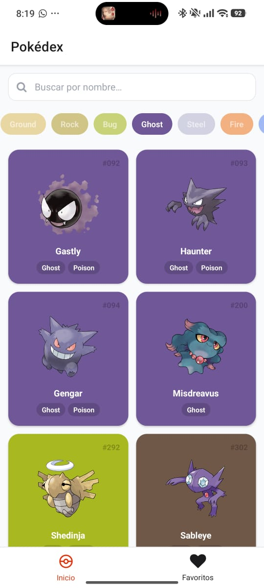
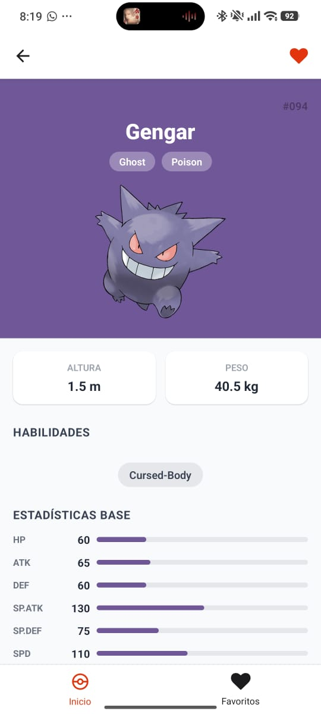
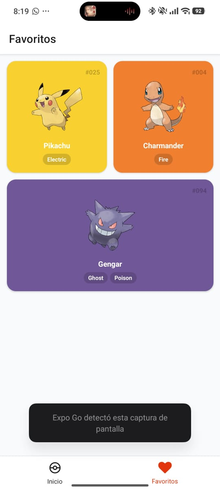
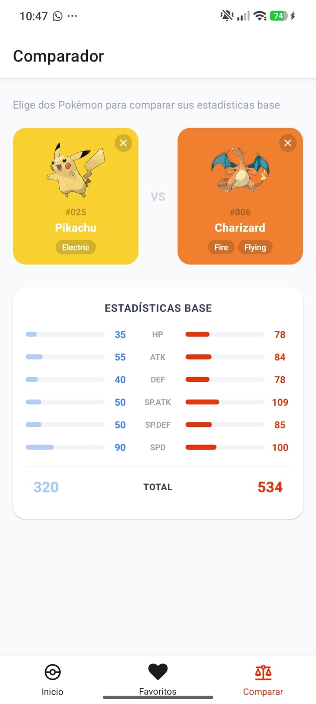

# Pokédex App

Aplicación móvil tipo Pokédex construida con Expo y React Native, que consume la PokéAPI para listar, buscar, filtrar, guardar favoritos y comparar Pokémon.

### Desarrollador

Jesus Alejandro Amador Hidalgo

## Tecnologías

- Expo SDK + React Native
- TypeScript
- React Navigation (Stack + Bottom Tabs)
- Axios
- AsyncStorage

## Instalación

```bash
cd pokedex
npm install
```

## Ejecutar

```bash
npx expo start
```

Luego escanea el QR con la app **Expo Go** en tu dispositivo, o presiona `a` para Android / `i` para iOS en el simulador.

## Funcionalidades

- Listado de Pokémon con imagen, número y tipos
- Búsqueda por nombre (filtro local)
- Filtro por tipo con chips de colores
- Detalle completo: imagen, medidas, habilidades y estadísticas con barras
- Favoritos persistentes con AsyncStorage
- Comparador de dos Pokémon con estadísticas base lado a lado

## Capturas de pantalla

### Pantalla de inicio


### Pantalla de detalle


### Pantalla de favoritos


### Pantalla de comparación


## Notas

- La API no requiere autenticación.
- Los favoritos se conservan al cerrar y reabrir la app.
- El comparador busca por nombre exacto o número de Pokédex.
